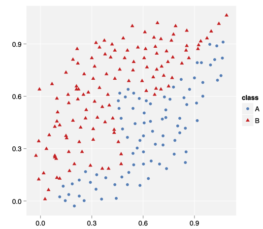
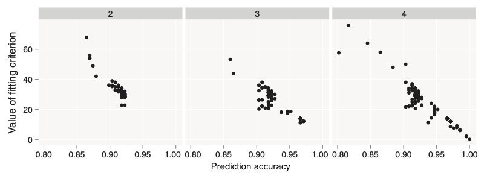
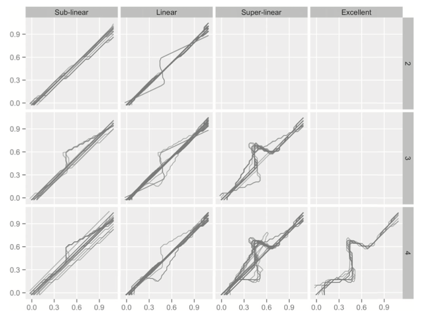
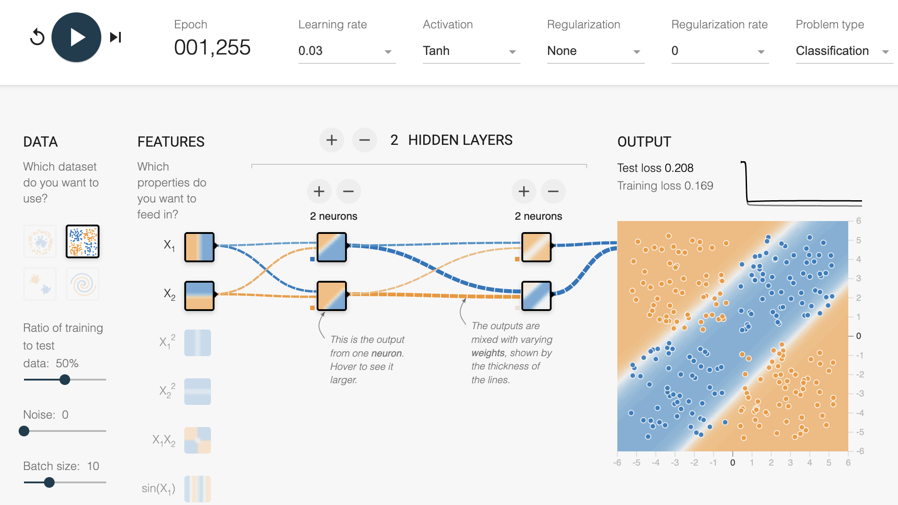
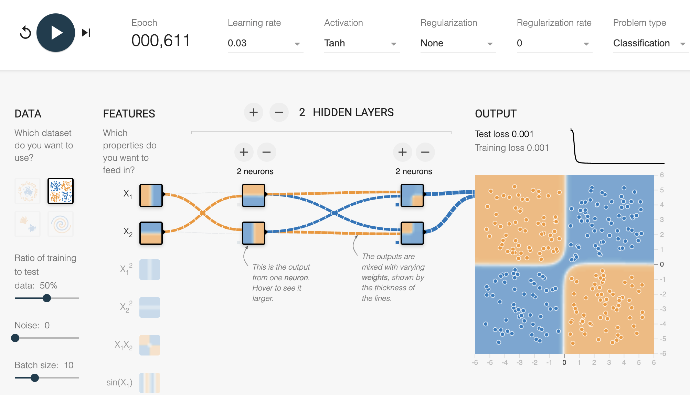
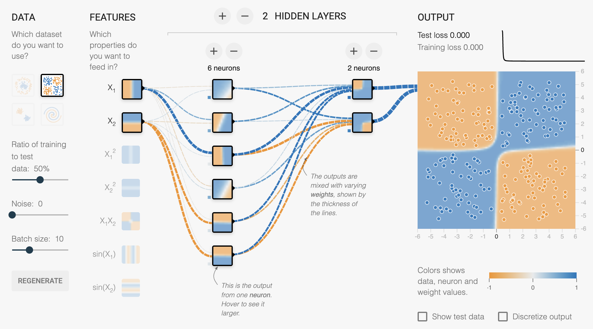
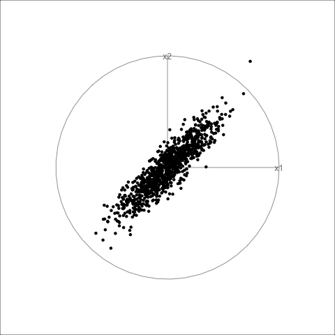
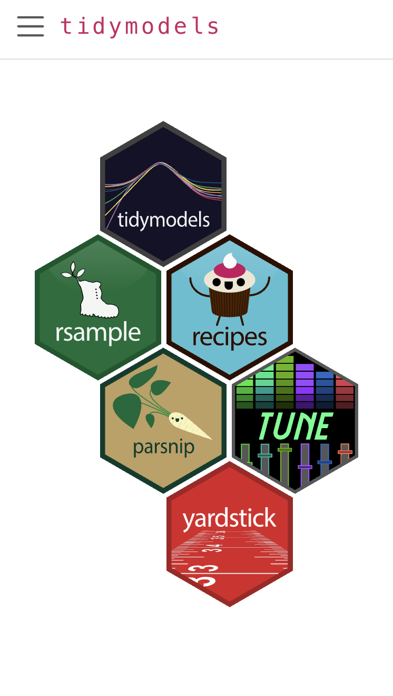

```{r, include = FALSE}
source("setup.R")
```

## Some history from 2007

::: {.panel-tabset}

## data

:::: {.columns}
::: {.column width="50%"}


<div class="antique-frame">
  
  
</div>

<!-- {width="600px"}-->

:::
::: {.column width="50%"}

The `wiggly` data. 

<br>

How many linear splits do you need to best separate the two groups?

<br>
<br>


::: {.f60}
Wickham et al (2015) Removing the Blindfold [https://doi.org/10.1002/sam.11271](https://doi.org/10.1002/sam.11271)
:::

:::
::::


## fit

:::: {.columns}
::: {.column width="30%"}

- 600 models 
- three architectures: 2, 3, 4 modes in hidden layer
- many random starts

:::
::: {.column width="70%"}

{width="1000px" fig-alt="Three scatterplots labelled 2, 3, 4, with prediction accuracy on the x axis and value of the fitting crieterion on the y axis. The black points in each plot are strongly negatively correlated. From plot 2 to plot 4, there is an increase of points in the bottom right corner, which indicates the best model fits."}

:::
::::

## models

:::: {.columns}
::: {.column width="60%"}

{width="1000px" fig-alt="A three by four grid of lineplots, labelled 2,3,4 on the rows, and sub-linear, linear, super-linear, and excellent on the columns. The lines are all running from lower left to upper right, some are linear and some have zig-zags. The lines in the excellent and 4 cell are all zig-zagged, because these represent the boundaries that are best for separating the two classes. "}
:::
::: {.column width="40%"}

- Only with 4 nodes do we get a handful of adequate models.
- Many fits with 4 nodes are still sub-optimal.

:::
::::

## learn

- Something as simple as the random number seed, can dramatically affect the model fit.
- A **simple parsimonious model is possible**, with the right choice of random seed.

::: {.info .narrow6}

Knowing what the data looks like helps inform the architecture.

:::

:::

## Fast forward to today

::: {.panel-tabset}

## play

<br><br>

::: {style="font-size: 150%; text-align: center;"}

The problem is still there!

:::

::: {style="font-size: 120%; text-align: center;"}

See [https://playground.tensorflow.org/](https://playground.tensorflow.org/) to play with this.

:::

## one fit

{width="1200px" fig-align="center" fig-alt="Screenshot of the website, where the data chosen has four squares of colour (classes) in each corner: orange at top left and lower right, and blue at bottom left and upper right. The model fit, using two hidden layer nodes, shows a band of blue running from bottom left to upper right, which mismatches the true boundaries. The test loss is 0.208."}

## second fit

{width="1200px" fig-align="center" fig-alt="Screenshot of the website, showing same data as previous plot. This model fit, using two hidden layer nodes, pretty closely matches the true boundary. The test loss is 0.001."}

## third fit

{width="1200px" fig-align="center" fig-align="center" fig-alt="Screenshot of the website, showing same data as previous plot. This model fit, using six hidden layer nodes, pretty closely matches the true boundary. The test loss is 0.000. But most nodes are not uniquely contributing to the boundary."}

## learn


- Something as simple as the random number seed, STILL can dramatically affect the model fit.
- A **simple parsimonious model is possible**, with the right choice of random seed.
- In a more complex architecture, most nodes are indolent. 

::: {.info .narrow6}

Knowing what the data looks like helps inform the architecture.

:::

:::

## Objective {.focus-slide}

::: {.f80}
In these examples the data was 2D, so knowing what it (and the model fit) looks like is easy. 
:::

<br>

[This talk is about how we do this in [high dimensions]{.rn-fragment}.]{.fragment .letters .fadeIn}

<br>

::: {.f80}
[With a focus [diagnostics]{.rn-fragment}, [simplicity]{.rn-fragment}, [understandability]{.rn-fragment}, [explainability]{.rn-fragment}.]{.fragment} 
:::

## Outline

:::: {.columns}
::: {.column width="60%"}

- Secrets of the Rashomon quartet
- Inspecting model fits
    - Setting up the data for exploration
    - Global v local interpretations
    - Explainers 
    - Visual toolbox
    - Complications 
- Wish list for [tidymodels](https://www.tidymodels.org/)
- Summary and resources
:::
::: {.column width="40%"}

{width="500px" fig-alt="Hand-sketched mulga seed pods."}
:::
::::

## Rashomon Quartet {.topic-slide}

## Rashomon Quartet [(1/5)]{.f50}

:::: {.columns}
::: {.column width="30%"}

**Anscombe's quartet**

```{r}
#| label: anscombe1
#| fig-width: 3
#| fig-height: 3
#| out-width: 80%
#| echo: false
#| fig-alt: "Famous classic Ancombe's quartet of scatterplots: clockwise from top left to bottom left, positive moderate association, strong non-linear association, linear and an outlier, vertical and an outlier. There are 11 green points in each, and a yellow regression line overlaid."
anscombe_m <- data.frame()

for (i in 1:4)
  anscombe_m <- rbind(anscombe_m, 
    data.frame(set=i, x=anscombe[,i], 
               y=anscombe[,i+4]))

ggplot(anscombe_m, aes(x=x, y=y)) + 
  geom_smooth(method="lm", colour=ochre_clrs[1],
              fullrange=TRUE, se=F) +
  geom_point(size=1.5, colour=ochre_clrs[2], alpha=0.7) + 
  facet_wrap(~set, ncol=2, scales="free") +
  scale_x_continuous(expand = expansion(mult = 0.1)) +
  scale_y_continuous(expand = expansion(mult = 0.1)) +
  theme_bw() + 
  theme(panel.background = element_rect(fill = 'transparent', colour = "black"),
        axis.text = element_blank())
```

::: {.f70}

```{r}
#| echo: false
anscombe_smry <- anscombe_m |>
  group_by(set) |>
  summarise(mx = mean(x),
          sx = sd(x),
          my = mean(y),
          sy = sd(y),
          r = cor(x, y))
anscombe_smry |> 
  mutate(mx = label_number(accuracy = 0.1)(mx),
         sx = label_number(accuracy = 0.2)(sx),
         my = label_number(accuracy = 0.1)(my),
         sy = label_number(accuracy = 0.2)(sy),
         r = label_number(accuracy = 0.2)(r)
  ) |>
  kable(align = c("c", "r", "r", "r", "r", "r"),
        col.names = c("set", "$\\bar{x}$", "$s_x$", "$\\bar{y}$", "$s_y$", "$r$")) 
  
```
:::

:::

::: {.column width="70%"}

::: {.fragment}
**Rashomon quartet**

::: {.f80}
- four predictive models [same performance]{.rn-fragment} with $R^2 = 0.729$ and $RMSE = 0.354$ (test set), but [different explanations]{.rn-fragment}.
- $y$ continuous response, $x_1, x_2, x_3$ continuous predictors.
:::

::: {.fragment}

```{r}
#| label: rashomon1
#| fig-width: 5
#| fig-height: 2
#| out-width: 90%
#| fig-alt: "Three plots labelled Predicted on the y axis and x1, x2, x3, respectively on the x axis. In each there are four curves: solid dark purple is LM, short dash light purple is DT, long dash green is RF, and long dahs and space light green is NN. The LM is straight in all, with strong positive slope in the first, smaller positive and negative slopes, respectively in the other two. The other models all have more of a flat S shape."
load("rashomon/pd_dt.rda")
load("rashomon/pd_rf.rda")
load("rashomon/pd_lm.rda")
load("rashomon/pd_nn.rda")
pd <- bind_rows(pd_lm$agr_profiles, 
                pd_dt$agr_profiles, 
                pd_rf$agr_profiles, 
                pd_nn$agr_profiles) |>
  mutate(`_label_` = factor(`_label_`, 
    levels = c("linear regression", "decision tree",
               "random forest", "neural network"),
    labels = c("LM", "DT", "RF", "NN"))) 

ggplot(pd, aes(x=`_x_`, y=`_yhat_`, colour=`_label_`)) +
  geom_line(aes(linetype = `_label_`)) + 
  facet_wrap(~`_vname_`, ncol = 3) +
  scale_colour_viridis_d("", end = 0.9) +
  scale_linetype("") +
  xlab("") +
  ylab("predicted") +
  ggtitle("Partial dependence plots") +
  theme_minimal() + 
  theme(aspect.ratio = 1,
    panel.background = element_rect(fill = 'transparent', colour = "black"), 
    panel.grid = element_blank(),
        #legend.position = "bottom",
        axis.text = element_blank())

```

:::

[Source: [Biecek et al (2024) Performance Is Not Enough](https://www.tandfonline.com/action/showCitFormats?doi=10.1080/10618600.2024.2344616)]{.f50}

:::

:::
::::

## Rashomon Quartet [(2/5)]{.f50}

:::: {.columns}
::: {.column}


How do you engineer such data? What does this data look like?

Why do the models disagree in their explanation?

<br>

::: {.info .fragment}

Using high-dimensional visualisation can help understand the data and the potential for disagreement.

That is, tours, linear combinations of the variables shown as a movie.

:::

:::
::: {.column}


::: {.fragment}

Start simply, with a scatterplot matrix of the predictors.

```{r}
#| label: rashomon2
#| fig-width: 4
#| fig-height: 4
#| out-width: 70%
#| fig-alt: "Scatterplot matrix of x1, x2, x3. All the scatterplots show strong positive linear association, and the correlation for each is 0.9."
train <- read_delim("rashomon/rq_train.csv", delim=";")
ggscatmat(train, columns = 2:4)
```

:::

:::
::::

## Rashomon Quartet [(3/5)]{.f50}

:::: {.columns}
::: {.column}

**Predictors** in a tour

::: {.f70}
The predictors are strongly linearly associated.
:::

```{r}
#| fig-width: 10
#| fig-height: 8
#| out-width: 80%
#| echo: false
#| eval: false
#htmltools::tags$style("
#  div.timelineContainer { left: 0px !important; right: 0px !important; }
#  div.timeline { left: 42px !important; right: 0px !important; }
#")
predictors_detour <- readRDS("detour/predictors_detour.rds")
predictors_detour
```

{fig-alt="Animation showing many 2D linear projections of x1-x3 as scatterplots. The shape is elliptical in 3D."}

::: 
::: {.column}

::: {.fragment}

Add the **Response**

::: {.f70}

There's a very slight nonlinear association.

:::

```{r}
#| fig-width: 10
#| fig-height: 8
#| out-width: 80%
#| echo: false
#| fig-alt: "Very similar to the last animation, except now there is a slight curl of points at each end of the ellipse."
train_all_detour <- readRDS("detour/train_all_detour.rds")
train_all_detour
```


:::

:::
::::

## Rashomon Quartet [(4/5)]{.f50}

:::: {.columns}
::: {.column}

::: {.f70}
Let's make this more conventional, **response on the vertical axis** and predictors on the horizontal.
:::

```{r}
#| fig-width: 10
#| fig-height: 8
#| out-width: 100%
#| echo: false
#| fig-alt: "Same as the last animation, except that the y axis is vertical, and the x axis shows a linear projection of the three predictors."
htmltools::tags$style("
  div.timelineContainer { left: 0px !important; right: 0px !important; }
  div.timeline { left: 42px !important; right: 0px !important; }
")
train_detour <- readRDS("detour/train_detour.rds")
train_detour
```
:::
::: {.column}

::: {.fragment}

::: {.f70}
Compare **fitted**  (black) with **observed**  (yellow) values: LM.
:::

```{r}
#| fig-width: 10
#| fig-height: 8
#| out-width: 100%
#| echo: false
#| fig-alt: "Same as the last animation, except that the points corresponding to training data are yellow, and purple points correspond to their fitted values on the LM model. In one combination of x1 and x2 the fitted values perfectly lie on a single line."
train_lm_detour <- readRDS("detour/train_lm_detour.rds")
train_lm_detour
```

:::
:::

::::

## Rashomon Quartet [(5/5)]{.f50}

:::: {.columns}
::: {.column}

::: {.f70}
Compare **fitted** (black) with **observed** (yellow) values: NN.
:::

```{r}
#| fig-width: 10
#| fig-height: 8
#| out-width: 100%
#| echo: false
#| fig-alt: "Same as the last animation, except that the purple points correspond to the fitted values of a NN model. The model has some curvature, doesn't ever collapse into a single curved line, and the tails have multiple bands."
train_nn_detour <- readRDS("detour/train_nn_detour.rds")
train_nn_detour
```
:::
::: {.column}

::: {.fragment}

::: {.f70}
Compare **fitted values** from two models: **LM vs NN**.
:::

<details class="note">
<summary>Click to see interpretation</summary>

The NN model captures the small nonlinear relationship, but it has some strange artefacts, particularly the multiple bands. The partial dependence plots hid this.

</details>

```{r}
#| fig-width: 10
#| fig-height: 8
#| out-width: 100%
#| echo: false
#| fig-alt: "Same as the last animation, except that the purple points correspond to the fitted values of a NN model, and green correspond to those of the LM model. The difference between models is in the extremes, where we can see the NN has curvature and the LM does not."
model_detour3 <- readRDS("detour/model_detour3.rds")
model_detour3
```

:::
:::
::::

## {.center}

::: {.narrow6}
::: {.info}

The fit for a linear model (mostly) can be seen from a single projection, because the points will line up.

For *nonlinear models*, there is *no single projection* that can capture the fit. But we can **zoom** into a smaller region, and even **slice** into this region to better see the fit.

:::
:::

## Explainers {.topic-slide}

## Remember the good old days? 

:::: {.columns}
::: {.column width="40%"}
```{r}
#| label: trees
#| echo: false
#| fig-width: 5
#| fig-height: 4
#| out-width: 90%
data(trees)
p_trees <- ggplot(trees, aes(x=Girth, y=Height)) +
  geom_point(colour = "#435d42") +
  xlab("Diameter (in)") +
  ylab("Height (ft)")
trees_lm <- lm(Height~Girth, trees)
p_trees + geom_abline(
  intercept = coefficients(trees_lm)[1],
  slope = coefficients(trees_lm)[2],
  colour = "#b1b646", linewidth = 2) +
  theme_minimal() +
  theme(panel.background = element_rect(fill = 'transparent', colour = "black"))
```

:::
::: {.column width="60%"}


::: {.f70}
```{r}
#| echo: false
tidy(trees_lm) |>
  mutate(
    estimate = label_number(accuracy = 0.1)(estimate),
    std.error = label_number(accuracy = 0.01)(std.error),
    statistic = label_number(accuracy = 0.1)(statistic),
    p.value = label_number(accuracy = 0.001)(p.value)
  ) |>
  kable(align = c("l", "r", "r", "r", "r"))
```
:::

<br>

INTERPRETATION

*If the* **diameter** *increases by* **one inch**, the **height** *of the tree will be approximately* **one foot taller***, on average.* 

:::
::::

{width="800px" fig-align="center" fig-alt="View of a breakfast market in Warsaw. There is a little fence around trees surrounding white tent stalls and deck chairs on the grass."}

## What are explainers?

:::: {.columns"

::: {.column}

::: {.narrow9}

[**Global**]{.rn-fragment} explainability 

- magnitude of coefficients
- partial dependence plots
- permutation variable importance

applies to the entire data, but practically only if the model is a linear model. *For nonlinear models, global explainability will* **not capture** *intricate differences.*

:::

:::
::: {.column}

[**Local**]{.rn-fragment} explainability

- **LIME**: fits a linear model locally
- **Shapley values**: change in fit if predictor is removed
- **Counterfactuals**: closest point of different class (classification)
- **Anchors**: make rectangle as big as possible that contains (mostly) one class  (classification)

Computed at the individual observation level. 

::: {.f70}

*For more details, see Janith's virtual presentation at [Thur, 9 Jul, 11:10am, Explaining the Explainers](https://events.digital-research.academy/event/109/contributions/444/).*
:::

:::
::::

## Why use explainers?

:::: {.columns}
::: {.column width="40%"}

::: {.narrow9}
::: {.info}
Explainers provide a numerical value for each predictor, which describes their **influence** on the fitted model.
:::
:::
:::

::: {.column width="60%"}

Used for:

- local variable importance
- describing the model's nonlinearity (when computed for several nearby points)
- supporting or debunking predictions
- possibly even in legal challenges
- [ultimately get a peek into black box models]{.fragment .letters .fadeIn}

:::

::: {.fragment}
BUT, just like models, some explainers might be more **suitable**, given particular **observed data**.

SO, explainers might give [contradictory explanations]{.rn-fragment} for any observation. You may be even become more confused at this point.

:::

::::

## Outline of steps to explain the explainers

For categorical response - classification problem.

1. Simulate 2D data with two classes and nonlinear boundary.
2. Show how explainers work on 2D data.
3. Add noise variables to make multivariate data. [(Could also rotate structure into noise to hide it, but that is too much for today).]{.f70}
4. Examine the (local) boundary between classes in the fitted model, relative to the explanations. 
5. Do the explanations match what we can see about the local boundary, relative to the predictors? 

## Set up the data: Training, test, fit (and true) data sets {.center}

```{r}
#| label: data-setup
#| echo: true
#| fig-asp: 0.3
#| fig-alt: "Four plots of two predictors in a row. Scatterplots show training and test sets. A fine grid of points shows the fitted and the true model, for a two classes yellow and green. The true model has a zig zag pattern. The fitted model is less jagged and has some small islands, so does not perfectly capture the true boundary."
# Data is generated in data.R
load("data/sp_data_tr.rda")
load("data/sp_data_ts.rda")
load("data/sp_data_true.rda")

sp1 <- ggplot(sp_data_true, aes(x = x, y = y, colour = class)) +
  geom_point() +
  scale_colour_manual(values=ochre_clrs) +
  ggtitle("TRUE") +
  scale_x_continuous(expand = expansion(mult = 0.02)) +
  scale_y_continuous(expand = expansion(mult = 0.02)) +
  theme_weedy()
sp2 <- ggplot(sp_data_tr, aes(x = x, y = y, colour = class)) +
  geom_point() +
  scale_colour_manual(values=ochre_clrs) +
  ggtitle("TRAINING") +
  scale_x_continuous(expand = expansion(mult = 0.02)) +
  scale_y_continuous(expand = expansion(mult = 0.02)) +
  theme_weedy()
sp3 <- ggplot(sp_data_ts, aes(x = x, y = y, colour = class)) +
  geom_point() +
  scale_colour_manual(values=ochre_clrs) +
  ggtitle("TEST") +
  scale_x_continuous(expand = expansion(mult = 0.02)) +
  scale_y_continuous(expand = expansion(mult = 0.02))  +
  theme_weedy()
sp4 <- ggplot(sp_data_true, aes(x = x, y = y, colour = fitted)) +
  geom_point() +
  scale_colour_manual(values=ochre_clrs) +
  ggtitle("MODEL - explain this") +
  scale_x_continuous(expand = expansion(mult = 0.02)) +
  scale_y_continuous(expand = expansion(mult = 0.02)) +
  theme_weedy()
sp2 + sp3 + sp4 + sp1 + plot_layout(ncol=4)
```

::: {style = "margin-left: 300px;"}

::: {.info .fragment .narrow6}

To explain the model fit, it helps to have a full spread of predictor values in the domain, i.e. a square (hypercube in high dimensions).

:::
:::

## Explanations

:::: {.columns}
::: {.column}

These are the points we'll explain

::: {.panel-tabset}

## 1

```{r}
#| label: to-explain
#| eval: true
#| fig-width: 3
#| fig-height: 3
#| out-width: 70%
#| fig-alt: "Plot of the fitted model with two points labelled 1 and 2 drawn. Point 1 is at (0,0) which is the yellow area, and point 2 is half-way towards the lower left corner, in the green region. Both points are close to the boundary."
# Code for calculations is in explainers.R
load("data/explainers1.rda")
load("data/sp_pt_cf.rda")
load("data/sp_pt_cf_wide.rda")

p <- ggplot(sp_data_true, aes(x = x, y = y, colour = fitted)) +
  geom_point() +
  scale_colour_manual(values=ochre_clrs) +
  scale_x_continuous(expand = expansion(mult = 0.02)) +
  scale_y_continuous(expand = expansion(mult = 0.02)) +
  theme_weedy()

p + 
  geom_point(data=filter(sp_pt_cf, type=="pt"), 
             aes(x=x, y=y), 
             inherit.aes = FALSE) +
  geom_label_repel(data=filter(sp_pt_cf, type=="pt"), 
             aes(x=x, y=y, label=id), 
             alpha = 0.5,
             segment.colour = NA,
             inherit.aes = FALSE)

```

## 2

```{r}
#| label: counterfactuals
#| eval: true
#| fig-width: 3
#| fig-height: 3
#| out-width: 70%
#| fig-alt: "Same as the previous plot, but now there are two additional points, which are the counterfctuals for points 1 and 2. These are connected by line sgements. The counterfactual for point 1 is down and a little the the right, into the green region. For point 2 it is up, and slightly to the righ, in the yellow region."

p + 
  geom_point(data=sp_pt_cf, aes(x=x, y=y, shape=type), 
             inherit.aes = FALSE) +
  geom_segment(data=sp_pt_cf_wide, 
               aes(x=x_pt, y=y_pt, xend=x_cf, yend=y_cf), 
               inherit.aes = FALSE) +
  scale_shape_manual(values = c(4, 16))
```

:::

:::
::: {.column}

::: {.fragment}

Here are the explanations

```{r}
#| label: explainers
#| eval: true
kable(sp_explainers, format = "html") |>
  kable_styling(full_width = FALSE, font_size = 30) |>
  row_spec(0, extra_css = "border-bottom: 2px solid black;") |>
  row_spec(1, extra_css = "border-bottom: 2px solid black;") |>
  row_spec(5, extra_css = "border-bottom: 2px solid black;") |>
  row_spec(9, extra_css = "border-bottom: 2px solid black;")

```

::: {.f70}

Mostly, they agree, except counterfactuals for observation 2.
:::

:::

:::
::::

## Do this in four dimensions {.focus-slide}

- Add two noise dimensions
- Quick check of training data (and test) training data using a grand tour, to see what model is based on
- Fit model, create representation of fit
- Use global importances to examine fit
- Compute explainers
- Zoom into to local area of observation
- Use local explanations to vary the projection

## Training data

:::: {.columns}
::: {.column}

[Quick overview with a **grand tour**]{.f70}

```{r}
#| fig-width: 10
#| fig-height: 8
#| fig-align: center
#| out-width: 100%
#| fig-alt: "Animation showing 2D projections of the 4D training data as scatterplots. About half the points are the yellow group and half the green group. The projection coefficients are shown as four axes labelled x1, x2, x3, x4. In some projections separations between the yellow and green classes can be seen."
#| echo: false
# Code for making animations is in graphics.R
sp4_tr_detour_gt <- readRDS("detour/sp4_tr_detour_gt.rds")
sp4_tr_detour_gt
```


:::
::: {.column}

::: {.fragment}

[Focus on difference between classes with **guided tour**]{.f70}

```{r}
#| fig-width: 10
#| fig-height: 8
#| fig-align: center
#| out-width: 100%
#| fig-alt: "Similar to the previous animation, except that the sequence of projections shown moves towards a reasonably separation of the two classes."
#| echo: false
sp4_tr_detour <- readRDS("detour/sp4_tr_detour.rds")
sp4_tr_detour
```

:::

:::
::::

## Examine the fitted model

:::: {.columns}
::: {.column}

[Viewing the fitted model, using a **guided tour**]{.f70}

```{r}
#| fig-width: 10
#| fig-height: 8
#| fig-align: center
#| out-width: 100%
#| fig-alt: "Similar to the previous animation, except that now the points are the full grid and they are coloured by the predicted class. The sequence of projections follows a guided tour, so the last one shows a reasonable separation of the two classes."
#| echo: false
sp4_true_detour <- readRDS("detour/sp4_true_detour.rds")
sp4_true_detour
```


:::
::: {.column}

::: {.fragment}

[**Slice display** can make boundary easier to see]{.f70}

```{r}
#| fig-width: 10
#| fig-height: 8
#| fig-align: center
#| out-width: 100%
#| fig-alt: "Similar to the previous animation, except that now we are viewing a slice through the middle of the data. The difference between the two groups is slightly cleaner."
#| echo: false
sp4_true_detour_slice <- readRDS("detour/sp4_true_detour_slice.rds")
sp4_true_detour_slice
```

:::

:::
::::

## Compute importances

:::: {.columns}
::: {.column}

Points of interest are:

```{r}
#| label: pt-explainers4
#| echo: false
# Code in explainers4.R
load("data/sp4_pt.rda")
pt |>
  mutate(id = c(1,2)) |>
  select(id, x1:class) |>
  mutate(class = fct_recode(class, yellow = "Above", green = "Below")) |>
  mutate(x1 = label_number(accuracy = 0.2)(x1),
         x2 = label_number(accuracy = 0.2)(x2),
         x3 = label_number(accuracy = 0.2)(x3),
         x4 = label_number(accuracy = 0.2)(x4)) |>
  kable(, format = "html",
        align = c("c", "r", "r", "r", "r", "l"),
        col.names = c("id", "x1", "x2", "x3", "x4", "class")) |>
    kable_styling(full_width = FALSE, font_size = 30) 
```

And the explainers are:

```{r}
#| label: explainers4
#| echo: false
load("data/explainers4.rda")
kable(sp4_explainers, format = "html") |>
  kable_styling(full_width = FALSE, font_size = 30) |>
  row_spec(0, extra_css = "border-bottom: 2px solid black;") |>
  row_spec(1, extra_css = "border-bottom: 2px solid black;") |>
  row_spec(3, extra_css = "border-bottom: 2px solid black;") |>
  row_spec(5, extra_css = "border-bottom: 2px solid black;")
```
:::
::: {.column}

Location of points in the training data

```{r}
#| fig-width: 10
#| fig-height: 8
#| fig-align: center
#| out-width: 100%
#| fig-alt: "This is the animation of the training data with points 1 and 2 highlighted. We can see that similar to the 2D example they both are located close to the border between classes."
#| echo: false
sp4_tr_detour_pts <- readRDS("detour/sp4_tr_detour_pts.rds")
sp4_tr_detour_pts
```

:::
::::

## Explore variable importance (globally) 

:::: {.columns}
::: {.column}

[Point 1, radial tour, $x_1$ removed.]{.f70}

```{r}
#| fig-width: 10
#| fig-height: 8
#| fig-align: center
#| out-width: 100%
#| fig-alt: "This is the animation of the fitted data, starting from the best projection to show the two classes, so far. The predictor x1 is rotated out of the projection, and it does little to change the boundary."
#| echo: false
sp4_fitted_detour_x1 <- readRDS("detour/sp4_fitted_detour_x1.rds")
sp4_fitted_detour_x1
```

:::
::: {.column}


[Point 1, radial tour, $x_2$ removed.]{.f70}

```{r}
#| fig-width: 10
#| fig-height: 8
#| fig-align: center
#| out-width: 100%
#| fig-alt: "This is the animation of the fitted data, starting from the best projection to show the two classes, so far. The predictor x2 is rotated out of the projection, and the boundary disappears."
#| echo: false
sp4_fitted_detour_x2 <- readRDS("detour/sp4_fitted_detour_x2.rds")
sp4_fitted_detour_x2
```

:::
::::

## Explore variable importance (locally) [(1/2)]{.f50} 

:::: {.columns}
::: {.column}


[Point 1, radial tour, $x_2$ removed.]{.f70}

```{r}
#| fig-width: 10
#| fig-height: 8
#| fig-align: center
#| out-width: 100%
#| fig-alt: "This is the animation of the fitted data, in a very local neighbourhood of point1, starting from the best projection to show the two classes, so far. The boundary here looks quite linear. The predictor x2 is rotated out of the projection, and the boundary disappears."
#| echo: false
sp4_d1_detour_x2 <- readRDS("detour/sp4_d1_detour_x2.rds")
sp4_d1_detour_x2
```

:::
::: {.column}


[Point 1, radial tour, $x_4$ removed.]{.f70}

```{r}
#| fig-width: 10
#| fig-height: 8
#| fig-align: center
#| out-width: 100%
#| fig-alt: "This is the animation of the fitted data, in a very local neighbourhood of point1, starting from the best projection to show the two classes, so far. The boundary here looks quite linear. The predictor x2 is rotated out of the projection, and the boundary doesn't change much."
#| echo: false
sp4_d1_detour_x4 <- readRDS("detour/sp4_d1_detour_x4.rds")
sp4_d1_detour_x4
```


:::
::::

## Explore variable importance (locally) [(2/2)]{.f50}

:::: {.columns}
::: {.column}


[Point 2, radial tour, $x_2$ removed.]{.f70}

```{r}
#| fig-width: 10
#| fig-height: 8
#| fig-align: center
#| out-width: 100%
#| fig-alt: "This is the animation of the fitted data, in a very local neighbourhood of point1, starting from the best projection to show the two classes, so far. The boundary here looks quite linear. The predictor x2 is rotated out of the projection, and the boundary doesn't change much."
#| echo: false
sp4_d2_detour_x2 <- readRDS("detour/sp4_d2_detour_x2.rds")
sp4_d2_detour_x2
```

:::
::: {.column}


[Point 2, radial tour, $x_4$ removed.]{.f70}

```{r}
#| fig-width: 10
#| fig-height: 8
#| fig-align: center
#| out-width: 100%
#| fig-alt: "This is the animation of the fitted data, in a very local neighbourhood of point1, starting from the best projection to show the two classes, so far. The boundary here looks quite linear. The predictor x4 is rotated out of the projection, and the boundary disappears."
#| echo: false
sp4_d2_detour_x4 <- readRDS("detour/sp4_d2_detour_x4.rds")
sp4_d2_detour_x4
```

:::
::::

## Inside the tour toolbox {.center}

What we learned was that the **boundary**, [*local to each point was quite different*]{.fragment .bounce}, and actually only [*one variable at each*]{.fragment .bounce} was most [*important*]{.fragment .bounce} in **distinguishing** it from the **other class**.

::: {.narrow9}
::: {.info}

- **grand tour**: *random* projections - use this to get a quick **overview**. 
- **guided tour**: choice of projections follows an *optimisation*, here difference between the two classes - use this find **specific structure**.
- **radial tour**: new projection *removes* a variable - use this to examine sensitivity of structure to that variable.

<br>

- **slice display**: points that are *further* than cutoff distance from a projection plane through the data centre are *faded* - use to examine **nonlinear structure**.

:::
:::

## Complications

:::: {.columns}
::: {.column}

- many more variables
- dependencies between variables
- distribution of predictors: sparse/dense, non-uniform sampling

Most of these are surmountable, except for bad data.

:::
::: {.column}
:::
::::

## tidymodels {.topic-slide}

## It is delightful!

:::: {.columns}
::: {.column width="30%"}


::: 
::: {.column width="70%"}

::: {.panel-tabset}

## previously

::: {.f70}
Each package has a different API<br>
Switching models means rewriting
your entire training block
:::

```{r}
#| eval: false
#| code-fold: false
# Using glmnet for logistic regression
library(glmnet)
x_train <- model.matrix(outcome ~ ., train)[,-1]
y_train <- train$outcome
fit_lasso <- cv.glmnet(x_train, y_train,
                        family = "binomial")
preds_lasso <- predict(fit_lasso, x_test,
  s = "lambda.min", type = "response")

# Now switch to random forest?
# Completely different API…
library(randomForest)
fit_rf <- randomForest(outcome ~ ., data = train,
                        ntree = 500)
preds_rf <- predict(fit_rf, test, type = "prob")[,2]

# And XGBoost? Totally different again…
library(xgboost)
dtrain <- xgb.DMatrix(x_train, label = y_train)
fit_xgb <- xgb.train(list(objective="binary:logistic"),
                     dtrain, nrounds = 100)
preds_xgb <- predict(fit_xgb, xgb.DMatrix(x_test))
```

## tidymodels — parsnip

::: {.f70}
With tidymodels — parsnip<br>
One consistent interface regardless of
the underlying engine. Swap with one line.
:::

```{r}
#| eval: false
#| code-fold: false

# Logistic regression (glmnet engine)
spec <- logistic_reg(penalty = tune()) |>
  set_engine("glmnet")

# Switch to random forest? Change 2 lines.
spec <- rand_forest(trees = 500) |>
  set_engine("randomForest") |>
  set_mode("classification")

# Switch to XGBoost? Same pattern.
spec <- boost_tree(trees = 100) |>
  set_engine("xgboost") |>
  set_mode("classification")

# The rest of your code never changes —
# fit(), predict(), and metrics work
# identically for all three.
fit <- fit(spec, outcome ~ ., data = train)
preds <- predict(fit, test, type = "prob")
```
:::

::: 
::::

## Better integration with visualisation for diagnostics


::: {.panel-tabset}

## pre-processing

```{.r code-line-numbers="|1-3|4-8|9-12"}
rec <- recipe(outcome ~ ., data = train) |>
  step_BoxCox(all_numeric_predictors()) |>
  step_other(all_nominal_predictors(), threshold = .1) 

# Extract the data as it exists after each step
rec |>
  prep() |>
  taste(after = c(1,2))

# Then plot each of the data 
# before and 
# after each step
```

<br>

`taste()` would allow looking at what we are doing to the data at any step in the workflow. 

## fit

```{.r code-line-numbers="|1-4|5-7"}
fit <- workflow() |>
  add_recipe(rec) |>
  add_model(spec) |>
  fit(data = train)

fit |>
  plate(train, n = 10000)  # random uniform grid + predictions + more
```

<br>

`plate()` would operate like the [classifly](http://had.co.nz/classifly/) package, and include values such as `advantage` (measuring distance from boundary for classification) and `boundary` (marking points near a boundary), ...

:::


<!--
## Testing more fragments

[This is letter animation]{.fragment .letters .fadeIn}

[This is letter puffIn]{.fragment .puffIn}

[This is letter perspectiveUpReturn]{.fragment .perspectiveUpReturn}

This is [word]{.fragment .bounce} bounce.

[highlighted word]{.rn-fragment}
-->

## Summary

:::: {.columns}
::: {.column width="60%"}

::: .{narrow9}

- Visual tools can help **understand** what the black box is doing. Let's work with our eyes open!
- There is so much **scope** for research, methodology and software for explaining model.
- *For developers*: Make it easier to **deconstruct** your model:
    - NNs and ensembles: models at nodes, predictions, weights
    - Importance scores
- [Give power to the people!]{.rn-fragment}

:::

:::
::: {.column width="40%"}

{width="500px" fig-align="center"}

[Photo: Mulga, Great Victoria Desert, courtesy of Lyn Cook]{.f50}

:::
::::

## Resources

::: {.f80}

:::: {.columns}
::: {.column width="50%"}


Visualisation and software

- [Cook & Laa (2025) Interactively exploring high-dimensional data and models in R](https://dicook.github.io/mulgar_book/) 
- [Wickham et al (2015) Removing the Blindfold](https://doi.org/10.1002/sam.11271)
- [tourr](https://ggobi.github.io/tourr/): Algorithms to generate sequences of linear projections
- [detourr](https://casperhart.github.io/detourr/): Portable and performant tours
- emerging packages: [sillysplines](https://janithwanni.github.io/sillysplines/), [kumquat](https://janithwanni.github.io/kumquat/), [kultarr](https://janithwanni.github.io/kultarr/).

:::
::: {.column width="50%"}


Machine learning and explainability

- [Biecek & Burzykowski (2020) Explanatory Model Analysis](https://ema.drwhy.ai/)
- [Boehmke & Greenwell (2020) Hands-On Machine Learning with R](https://bradleyboehmke.github.io/HOML/)
- [Molnar (2025) Interpretable Machine Learning](https://christophm.github.io/interpretable-ml-book/)
- [Kuhn & Silge (2023) Tidy Modeling with R](https://www.tmwr.org/)

:::
::::

<br><br>

Slides made in [Quarto](https://quarto.org/), with code included. Cool aspects [due to our Hacky Hour tutorial by the PhD students](https://numbat.space/posts/quarto-slide-extension/) describing available thanks to [Emil Hvitfeldt](emilhvitfeldt.github.io/quarto-revealjs-more-fragments)

<br>

<a rel="license" href="http://creativecommons.org/licenses/by-sa/4.0/"></a><br />This work is licensed under a <a rel="license" href="http://creativecommons.org/licenses/by-sa/4.0/">Creative Commons Attribution-ShareAlike 4.0 International License</a>.

:::
